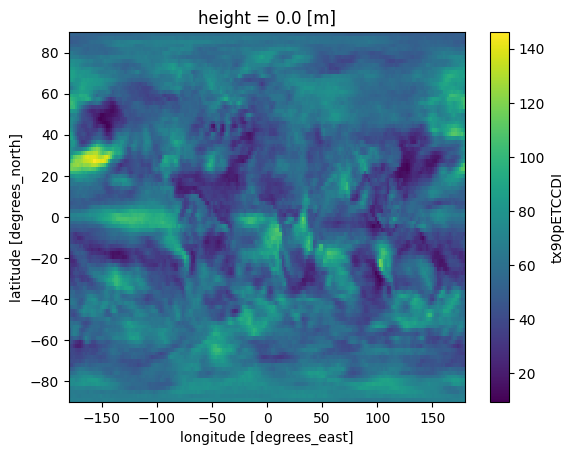

# Registering a dataset that will exist in the future

## Here we use a freva plugin run that has been applied


```python
import freva
import xarray as xr
from freva._futures import Futures
hist_id = 3085 # We can get this ID using the freva.history command
_ = Futures.register_future_from_history_id(hist_id)
```

## Let's search for the data


```python
list(freva.databrowser(variable="tx90petccdi"))
```


    ['future:///scratch/b/b380001/futures/6def5135a687932d27f419a3e993b5bd68aa03425ff0378cfb7745c0aef497a5/cmip5/output1/mpi-m/mpi-esm-lr/historical/yr/atmos/1day/r1i1p1/tx90pETCCDI/tx90pETCCDI_1day_mpi-esm-lr_historical_r1i1p1_199007020000-199207011200']


## The  data doesn't exist yet, but can be created on demand:


```python
dset = xr.open_mfdataset(
    freva.databrowser(variable="tx90petccdi", 
                      execute_future=True
    )
)
dset
```


    Output()


<pre style="white-space:pre;overflow-x:auto;line-height:normal;font-family:Menlo,'DejaVu Sans Mono',consolas,'Courier New',monospace"></pre>


<div><svg style="position: absolute; width: 0; height: 0; overflow: hidden">
<defs>
<symbol id="icon-database" viewBox="0 0 32 32">
<path d="M16 0c-8.837 0-16 2.239-16 5v4c0 2.761 7.163 5 16 5s16-2.239 16-5v-4c0-2.761-7.163-5-16-5z"></path>
<path d="M16 17c-8.837 0-16-2.239-16-5v6c0 2.761 7.163 5 16 5s16-2.239 16-5v-6c0 2.761-7.163 5-16 5z"></path>
<path d="M16 26c-8.837 0-16-2.239-16-5v6c0 2.761 7.163 5 16 5s16-2.239 16-5v-6c0 2.761-7.163 5-16 5z"></path>
</symbol>
<symbol id="icon-file-text2" viewBox="0 0 32 32">
<path d="M28.681 7.159c-0.694-0.947-1.662-2.053-2.724-3.116s-2.169-2.030-3.116-2.724c-1.612-1.182-2.393-1.319-2.841-1.319h-15.5c-1.378 0-2.5 1.121-2.5 2.5v27c0 1.378 1.122 2.5 2.5 2.5h23c1.378 0 2.5-1.122 2.5-2.5v-19.5c0-0.448-0.137-1.23-1.319-2.841zM24.543 5.457c0.959 0.959 1.712 1.825 2.268 2.543h-4.811v-4.811c0.718 0.556 1.584 1.309 2.543 2.268zM28 29.5c0 0.271-0.229 0.5-0.5 0.5h-23c-0.271 0-0.5-0.229-0.5-0.5v-27c0-0.271 0.229-0.5 0.5-0.5 0 0 15.499-0 15.5 0v7c0 0.552 0.448 1 1 1h7v19.5z"></path>
<path d="M23 26h-14c-0.552 0-1-0.448-1-1s0.448-1 1-1h14c0.552 0 1 0.448 1 1s-0.448 1-1 1z"></path>
<path d="M23 22h-14c-0.552 0-1-0.448-1-1s0.448-1 1-1h14c0.552 0 1 0.448 1 1s-0.448 1-1 1z"></path>
<path d="M23 18h-14c-0.552 0-1-0.448-1-1s0.448-1 1-1h14c0.552 0 1 0.448 1 1s-0.448 1-1 1z"></path>
</symbol>
</defs>
</svg>
<style>/* CSS stylesheet for displaying xarray objects in jupyterlab.
 *
 */

:root {
  --xr-font-color0: var(--jp-content-font-color0, rgba(0, 0, 0, 1));
  --xr-font-color2: var(--jp-content-font-color2, rgba(0, 0, 0, 0.54));
  --xr-font-color3: var(--jp-content-font-color3, rgba(0, 0, 0, 0.38));
  --xr-border-color: var(--jp-border-color2, #e0e0e0);
  --xr-disabled-color: var(--jp-layout-color3, #bdbdbd);
  --xr-background-color: var(--jp-layout-color0, white);
  --xr-background-color-row-even: var(--jp-layout-color1, white);
  --xr-background-color-row-odd: var(--jp-layout-color2, #eeeeee);
}

html[theme=dark],
body[data-theme=dark],
body.vscode-dark {
  --xr-font-color0: rgba(255, 255, 255, 1);
  --xr-font-color2: rgba(255, 255, 255, 0.54);
  --xr-font-color3: rgba(255, 255, 255, 0.38);
  --xr-border-color: #1F1F1F;
  --xr-disabled-color: #515151;
  --xr-background-color: #111111;
  --xr-background-color-row-even: #111111;
  --xr-background-color-row-odd: #313131;
}

.xr-wrap {
  display: block !important;
  min-width: 300px;
  max-width: 700px;
}

.xr-text-repr-fallback {
  /* fallback to plain text repr when CSS is not injected (untrusted notebook) */
  display: none;
}

.xr-header {
  padding-top: 6px;
  padding-bottom: 6px;
  margin-bottom: 4px;
  border-bottom: solid 1px var(--xr-border-color);
}

.xr-header > div,
.xr-header > ul {
  display: inline;
  margin-top: 0;
  margin-bottom: 0;
}

.xr-obj-type,
.xr-array-name {
  margin-left: 2px;
  margin-right: 10px;
}

.xr-obj-type {
  color: var(--xr-font-color2);
}

.xr-sections {
  padding-left: 0 !important;
  display: grid;
  grid-template-columns: 150px auto auto 1fr 20px 20px;
}

.xr-section-item {
  display: contents;
}

.xr-section-item input {
  display: none;
}

.xr-section-item input + label {
  color: var(--xr-disabled-color);
}

.xr-section-item input:enabled + label {
  cursor: pointer;
  color: var(--xr-font-color2);
}

.xr-section-item input:enabled + label:hover {
  color: var(--xr-font-color0);
}

.xr-section-summary {
  grid-column: 1;
  color: var(--xr-font-color2);
  font-weight: 500;
}

.xr-section-summary > span {
  display: inline-block;
  padding-left: 0.5em;
}

.xr-section-summary-in:disabled + label {
  color: var(--xr-font-color2);
}

.xr-section-summary-in + label:before {
  display: inline-block;
  content: '►';
  font-size: 11px;
  width: 15px;
  text-align: center;
}

.xr-section-summary-in:disabled + label:before {
  color: var(--xr-disabled-color);
}

.xr-section-summary-in:checked + label:before {
  content: '▼';
}

.xr-section-summary-in:checked + label > span {
  display: none;
}

.xr-section-summary,
.xr-section-inline-details {
  padding-top: 4px;
  padding-bottom: 4px;
}

.xr-section-inline-details {
  grid-column: 2 / -1;
}

.xr-section-details {
  display: none;
  grid-column: 1 / -1;
  margin-bottom: 5px;
}

.xr-section-summary-in:checked ~ .xr-section-details {
  display: contents;
}

.xr-array-wrap {
  grid-column: 1 / -1;
  display: grid;
  grid-template-columns: 20px auto;
}

.xr-array-wrap > label {
  grid-column: 1;
  vertical-align: top;
}

.xr-preview {
  color: var(--xr-font-color3);
}

.xr-array-preview,
.xr-array-data {
  padding: 0 5px !important;
  grid-column: 2;
}

.xr-array-data,
.xr-array-in:checked ~ .xr-array-preview {
  display: none;
}

.xr-array-in:checked ~ .xr-array-data,
.xr-array-preview {
  display: inline-block;
}

.xr-dim-list {
  display: inline-block !important;
  list-style: none;
  padding: 0 !important;
  margin: 0;
}

.xr-dim-list li {
  display: inline-block;
  padding: 0;
  margin: 0;
}

.xr-dim-list:before {
  content: '(';
}

.xr-dim-list:after {
  content: ')';
}

.xr-dim-list li:not(:last-child):after {
  content: ',';
  padding-right: 5px;
}

.xr-has-index {
  font-weight: bold;
}

.xr-var-list,
.xr-var-item {
  display: contents;
}

.xr-var-item > div,
.xr-var-item label,
.xr-var-item > .xr-var-name span {
  background-color: var(--xr-background-color-row-even);
  margin-bottom: 0;
}

.xr-var-item > .xr-var-name:hover span {
  padding-right: 5px;
}

.xr-var-list > li:nth-child(odd) > div,
.xr-var-list > li:nth-child(odd) > label,
.xr-var-list > li:nth-child(odd) > .xr-var-name span {
  background-color: var(--xr-background-color-row-odd);
}

.xr-var-name {
  grid-column: 1;
}

.xr-var-dims {
  grid-column: 2;
}

.xr-var-dtype {
  grid-column: 3;
  text-align: right;
  color: var(--xr-font-color2);
}

.xr-var-preview {
  grid-column: 4;
}

.xr-index-preview {
  grid-column: 2 / 5;
  color: var(--xr-font-color2);
}

.xr-var-name,
.xr-var-dims,
.xr-var-dtype,
.xr-preview,
.xr-attrs dt {
  white-space: nowrap;
  overflow: hidden;
  text-overflow: ellipsis;
  padding-right: 10px;
}

.xr-var-name:hover,
.xr-var-dims:hover,
.xr-var-dtype:hover,
.xr-attrs dt:hover {
  overflow: visible;
  width: auto;
  z-index: 1;
}

.xr-var-attrs,
.xr-var-data,
.xr-index-data {
  display: none;
  background-color: var(--xr-background-color) !important;
  padding-bottom: 5px !important;
}

.xr-var-attrs-in:checked ~ .xr-var-attrs,
.xr-var-data-in:checked ~ .xr-var-data,
.xr-index-data-in:checked ~ .xr-index-data {
  display: block;
}

.xr-var-data > table {
  float: right;
}

.xr-var-name span,
.xr-var-data,
.xr-index-name div,
.xr-index-data,
.xr-attrs {
  padding-left: 25px !important;
}

.xr-attrs,
.xr-var-attrs,
.xr-var-data,
.xr-index-data {
  grid-column: 1 / -1;
}

dl.xr-attrs {
  padding: 0;
  margin: 0;
  display: grid;
  grid-template-columns: 125px auto;
}

.xr-attrs dt,
.xr-attrs dd {
  padding: 0;
  margin: 0;
  float: left;
  padding-right: 10px;
  width: auto;
}

.xr-attrs dt {
  font-weight: normal;
  grid-column: 1;
}

.xr-attrs dt:hover span {
  display: inline-block;
  background: var(--xr-background-color);
  padding-right: 10px;
}

.xr-attrs dd {
  grid-column: 2;
  white-space: pre-wrap;
  word-break: break-all;
}

.xr-icon-database,
.xr-icon-file-text2,
.xr-no-icon {
  display: inline-block;
  vertical-align: middle;
  width: 1em;
  height: 1.5em !important;
  stroke-width: 0;
  stroke: currentColor;
  fill: currentColor;
}
</style><pre class='xr-text-repr-fallback'>&lt;xarray.Dataset&gt;
Dimensions:      (time: 3, bnds: 2, lon: 192, lat: 96)
Coordinates:
  * time         (time) datetime64[ns] 1990-07-02 1991-07-02 1992-07-01T12:00:00
  * lon          (lon) float64 -179.1 -177.2 -175.3 -173.4 ... 175.3 177.2 179.1
  * lat          (lat) float64 -89.06 -87.19 -85.31 -83.44 ... 85.31 87.19 89.06
    height       float64 ...
Dimensions without coordinates: bnds
Data variables:
    time_bnds    (time, bnds) datetime64[ns] dask.array&lt;chunksize=(3, 2), meta=np.ndarray&gt;
    tx90pETCCDI  (time, lat, lon) float32 dask.array&lt;chunksize=(3, 96, 192), meta=np.ndarray&gt;
Attributes: (12/36)
    CDI:                      Climate Data Interface version 2.0.5 (https://m...
    Conventions:              CF-1.4
    source:                   MPI-ESM-LR 2011; URL: http://svn.zmaw.de/svn/co...
    institution:              Max Planck Institute for Meteorology
    institute_id:             MPI-M
    experiment_id:            historical
    ...                       ...
    ETCCDI_software:          climdex.pcic
    ETCCDI_software_version:  1.1.11
    frequency:                yr
    creation_date:            2023-09-11T19:57:50Z
    title:                    ETCCDI indices computed on MPI-ESM-LR model out...
    CDO:                      Climate Data Operators version 2.0.5 (https://m...</pre><div class='xr-wrap' style='display:none'><div class='xr-header'><div class='xr-obj-type'>xarray.Dataset</div></div><ul class='xr-sections'><li class='xr-section-item'><input id='section-a510844f-caa7-46fc-9e6b-5ac071c5001b' class='xr-section-summary-in' type='checkbox' disabled ><label for='section-a510844f-caa7-46fc-9e6b-5ac071c5001b' class='xr-section-summary'  title='Expand/collapse section'>Dimensions:</label><div class='xr-section-inline-details'><ul class='xr-dim-list'><li><span class='xr-has-index'>time</span>: 3</li><li><span>bnds</span>: 2</li><li><span class='xr-has-index'>lon</span>: 192</li><li><span class='xr-has-index'>lat</span>: 96</li></ul></div><div class='xr-section-details'></div></li><li class='xr-section-item'><input id='section-b79353bc-969f-4f73-9f71-f747c58e3531' class='xr-section-summary-in' type='checkbox'  checked><label for='section-b79353bc-969f-4f73-9f71-f747c58e3531' class='xr-section-summary' >Coordinates: <span>(4)</span></label><div class='xr-section-inline-details'></div><div class='xr-section-details'><ul class='xr-var-list'><li class='xr-var-item'><div class='xr-var-name'><span class='xr-has-index'>time</span></div><div class='xr-var-dims'>(time)</div><div class='xr-var-dtype'>datetime64[ns]</div><div class='xr-var-preview xr-preview'>1990-07-02 ... 1992-07-01T12:00:00</div><input id='attrs-158665d4-98e5-48ba-b0e1-d710d65008b1' class='xr-var-attrs-in' type='checkbox' ><label for='attrs-158665d4-98e5-48ba-b0e1-d710d65008b1' title='Show/Hide attributes'><svg class='icon xr-icon-file-text2'><use xlink:href='#icon-file-text2'></use></svg></label><input id='data-405062fe-27ba-40be-aa4d-43e89d2bc433' class='xr-var-data-in' type='checkbox'><label for='data-405062fe-27ba-40be-aa4d-43e89d2bc433' title='Show/Hide data repr'><svg class='icon xr-icon-database'><use xlink:href='#icon-database'></use></svg></label><div class='xr-var-attrs'><dl class='xr-attrs'><dt><span>standard_name :</span></dt><dd>time</dd><dt><span>long_name :</span></dt><dd>time</dd><dt><span>bounds :</span></dt><dd>time_bnds</dd><dt><span>axis :</span></dt><dd>T</dd></dl></div><div class='xr-var-data'><pre>array([&#x27;1990-07-02T00:00:00.000000000&#x27;, &#x27;1991-07-02T00:00:00.000000000&#x27;,
       &#x27;1992-07-01T12:00:00.000000000&#x27;], dtype=&#x27;datetime64[ns]&#x27;)</pre></div></li><li class='xr-var-item'><div class='xr-var-name'><span class='xr-has-index'>lon</span></div><div class='xr-var-dims'>(lon)</div><div class='xr-var-dtype'>float64</div><div class='xr-var-preview xr-preview'>-179.1 -177.2 ... 177.2 179.1</div><input id='attrs-19464dfd-cca4-43af-9d4c-511f43824576' class='xr-var-attrs-in' type='checkbox' ><label for='attrs-19464dfd-cca4-43af-9d4c-511f43824576' title='Show/Hide attributes'><svg class='icon xr-icon-file-text2'><use xlink:href='#icon-file-text2'></use></svg></label><input id='data-32dbfb94-595e-4bdd-90c8-4617aede8b55' class='xr-var-data-in' type='checkbox'><label for='data-32dbfb94-595e-4bdd-90c8-4617aede8b55' title='Show/Hide data repr'><svg class='icon xr-icon-database'><use xlink:href='#icon-database'></use></svg></label><div class='xr-var-attrs'><dl class='xr-attrs'><dt><span>standard_name :</span></dt><dd>longitude</dd><dt><span>long_name :</span></dt><dd>longitude</dd><dt><span>units :</span></dt><dd>degrees_east</dd><dt><span>axis :</span></dt><dd>X</dd></dl></div><div class='xr-var-data'><pre>array([-179.0625, -177.1875, -175.3125, -173.4375, -171.5625, -169.6875,
       -167.8125, -165.9375, -164.0625, -162.1875, -160.3125, -158.4375,
       -156.5625, -154.6875, -152.8125, -150.9375, -149.0625, -147.1875,
       -145.3125, -143.4375, -141.5625, -139.6875, -137.8125, -135.9375,
       -134.0625, -132.1875, -130.3125, -128.4375, -126.5625, -124.6875,
       -122.8125, -120.9375, -119.0625, -117.1875, -115.3125, -113.4375,
       -111.5625, -109.6875, -107.8125, -105.9375, -104.0625, -102.1875,
       -100.3125,  -98.4375,  -96.5625,  -94.6875,  -92.8125,  -90.9375,
        -89.0625,  -87.1875,  -85.3125,  -83.4375,  -81.5625,  -79.6875,
        -77.8125,  -75.9375,  -74.0625,  -72.1875,  -70.3125,  -68.4375,
        -66.5625,  -64.6875,  -62.8125,  -60.9375,  -59.0625,  -57.1875,
        -55.3125,  -53.4375,  -51.5625,  -49.6875,  -47.8125,  -45.9375,
        -44.0625,  -42.1875,  -40.3125,  -38.4375,  -36.5625,  -34.6875,
        -32.8125,  -30.9375,  -29.0625,  -27.1875,  -25.3125,  -23.4375,
        -21.5625,  -19.6875,  -17.8125,  -15.9375,  -14.0625,  -12.1875,
        -10.3125,   -8.4375,   -6.5625,   -4.6875,   -2.8125,   -0.9375,
          0.9375,    2.8125,    4.6875,    6.5625,    8.4375,   10.3125,
         12.1875,   14.0625,   15.9375,   17.8125,   19.6875,   21.5625,
         23.4375,   25.3125,   27.1875,   29.0625,   30.9375,   32.8125,
         34.6875,   36.5625,   38.4375,   40.3125,   42.1875,   44.0625,
         45.9375,   47.8125,   49.6875,   51.5625,   53.4375,   55.3125,
         57.1875,   59.0625,   60.9375,   62.8125,   64.6875,   66.5625,
         68.4375,   70.3125,   72.1875,   74.0625,   75.9375,   77.8125,
         79.6875,   81.5625,   83.4375,   85.3125,   87.1875,   89.0625,
         90.9375,   92.8125,   94.6875,   96.5625,   98.4375,  100.3125,
        102.1875,  104.0625,  105.9375,  107.8125,  109.6875,  111.5625,
        113.4375,  115.3125,  117.1875,  119.0625,  120.9375,  122.8125,
        124.6875,  126.5625,  128.4375,  130.3125,  132.1875,  134.0625,
        135.9375,  137.8125,  139.6875,  141.5625,  143.4375,  145.3125,
        147.1875,  149.0625,  150.9375,  152.8125,  154.6875,  156.5625,
        158.4375,  160.3125,  162.1875,  164.0625,  165.9375,  167.8125,
        169.6875,  171.5625,  173.4375,  175.3125,  177.1875,  179.0625])</pre></div></li><li class='xr-var-item'><div class='xr-var-name'><span class='xr-has-index'>lat</span></div><div class='xr-var-dims'>(lat)</div><div class='xr-var-dtype'>float64</div><div class='xr-var-preview xr-preview'>-89.06 -87.19 ... 87.19 89.06</div><input id='attrs-449fd32d-6bf0-44a4-a58d-6c4cf4a6aafa' class='xr-var-attrs-in' type='checkbox' ><label for='attrs-449fd32d-6bf0-44a4-a58d-6c4cf4a6aafa' title='Show/Hide attributes'><svg class='icon xr-icon-file-text2'><use xlink:href='#icon-file-text2'></use></svg></label><input id='data-5138b331-3b13-48be-bc37-d8b1c6574f01' class='xr-var-data-in' type='checkbox'><label for='data-5138b331-3b13-48be-bc37-d8b1c6574f01' title='Show/Hide data repr'><svg class='icon xr-icon-database'><use xlink:href='#icon-database'></use></svg></label><div class='xr-var-attrs'><dl class='xr-attrs'><dt><span>standard_name :</span></dt><dd>latitude</dd><dt><span>long_name :</span></dt><dd>latitude</dd><dt><span>units :</span></dt><dd>degrees_north</dd><dt><span>axis :</span></dt><dd>Y</dd></dl></div><div class='xr-var-data'><pre>array([-89.0625, -87.1875, -85.3125, -83.4375, -81.5625, -79.6875, -77.8125,
       -75.9375, -74.0625, -72.1875, -70.3125, -68.4375, -66.5625, -64.6875,
       -62.8125, -60.9375, -59.0625, -57.1875, -55.3125, -53.4375, -51.5625,
       -49.6875, -47.8125, -45.9375, -44.0625, -42.1875, -40.3125, -38.4375,
       -36.5625, -34.6875, -32.8125, -30.9375, -29.0625, -27.1875, -25.3125,
       -23.4375, -21.5625, -19.6875, -17.8125, -15.9375, -14.0625, -12.1875,
       -10.3125,  -8.4375,  -6.5625,  -4.6875,  -2.8125,  -0.9375,   0.9375,
         2.8125,   4.6875,   6.5625,   8.4375,  10.3125,  12.1875,  14.0625,
        15.9375,  17.8125,  19.6875,  21.5625,  23.4375,  25.3125,  27.1875,
        29.0625,  30.9375,  32.8125,  34.6875,  36.5625,  38.4375,  40.3125,
        42.1875,  44.0625,  45.9375,  47.8125,  49.6875,  51.5625,  53.4375,
        55.3125,  57.1875,  59.0625,  60.9375,  62.8125,  64.6875,  66.5625,
        68.4375,  70.3125,  72.1875,  74.0625,  75.9375,  77.8125,  79.6875,
        81.5625,  83.4375,  85.3125,  87.1875,  89.0625])</pre></div></li><li class='xr-var-item'><div class='xr-var-name'><span>height</span></div><div class='xr-var-dims'>()</div><div class='xr-var-dtype'>float64</div><div class='xr-var-preview xr-preview'>...</div><input id='attrs-3b8dad7a-2cbd-4b81-994d-63d15811bd0d' class='xr-var-attrs-in' type='checkbox' ><label for='attrs-3b8dad7a-2cbd-4b81-994d-63d15811bd0d' title='Show/Hide attributes'><svg class='icon xr-icon-file-text2'><use xlink:href='#icon-file-text2'></use></svg></label><input id='data-51aba81a-68ad-44fe-a128-8f237ad16b44' class='xr-var-data-in' type='checkbox'><label for='data-51aba81a-68ad-44fe-a128-8f237ad16b44' title='Show/Hide data repr'><svg class='icon xr-icon-database'><use xlink:href='#icon-database'></use></svg></label><div class='xr-var-attrs'><dl class='xr-attrs'><dt><span>standard_name :</span></dt><dd>height</dd><dt><span>long_name :</span></dt><dd>height</dd><dt><span>units :</span></dt><dd>m</dd><dt><span>positive :</span></dt><dd>up</dd><dt><span>axis :</span></dt><dd>Z</dd></dl></div><div class='xr-var-data'><pre>[1 values with dtype=float64]</pre></div></li></ul></div></li><li class='xr-section-item'><input id='section-ad7b0cb3-947b-44e6-bc93-5f99eb3c0cf0' class='xr-section-summary-in' type='checkbox'  checked><label for='section-ad7b0cb3-947b-44e6-bc93-5f99eb3c0cf0' class='xr-section-summary' >Data variables: <span>(2)</span></label><div class='xr-section-inline-details'></div><div class='xr-section-details'><ul class='xr-var-list'><li class='xr-var-item'><div class='xr-var-name'><span>time_bnds</span></div><div class='xr-var-dims'>(time, bnds)</div><div class='xr-var-dtype'>datetime64[ns]</div><div class='xr-var-preview xr-preview'>dask.array&lt;chunksize=(3, 2), meta=np.ndarray&gt;</div><input id='attrs-85719e28-138e-4a51-ab41-81e244a8e69f' class='xr-var-attrs-in' type='checkbox' disabled><label for='attrs-85719e28-138e-4a51-ab41-81e244a8e69f' title='Show/Hide attributes'><svg class='icon xr-icon-file-text2'><use xlink:href='#icon-file-text2'></use></svg></label><input id='data-6a5c3776-9370-4dd8-8293-674069d273db' class='xr-var-data-in' type='checkbox'><label for='data-6a5c3776-9370-4dd8-8293-674069d273db' title='Show/Hide data repr'><svg class='icon xr-icon-database'><use xlink:href='#icon-database'></use></svg></label><div class='xr-var-attrs'><dl class='xr-attrs'></dl></div><div class='xr-var-data'><table>
    <tr>
        <td>
            <table style="border-collapse: collapse;">
                <thead>
                    <tr>
                        <td> </td>
                        <th> Array </th>
                        <th> Chunk </th>
                    </tr>
                </thead>
                <tbody>

                    <tr>
                        <th> Bytes </th>
                        <td> 48 B </td>
                        <td> 48 B </td>
                    </tr>

                    <tr>
                        <th> Shape </th>
                        <td> (3, 2) </td>
                        <td> (3, 2) </td>
                    </tr>
                    <tr>
                        <th> Dask graph </th>
                        <td colspan="2"> 1 chunks in 2 graph layers </td>
                    </tr>
                    <tr>
                        <th> Data type </th>
                        <td colspan="2"> datetime64[ns] numpy.ndarray </td>
                    </tr>
                </tbody>
            </table>
        </td>
        <td>
        <svg width="130" height="170" style="stroke:rgb(0,0,0);stroke-width:1" >

  <!-- Horizontal lines -->
  <line x1="0" y1="0" x2="80" y2="0" style="stroke-width:2" />
  <line x1="0" y1="120" x2="80" y2="120" style="stroke-width:2" />

  <!-- Vertical lines -->
  <line x1="0" y1="0" x2="0" y2="120" style="stroke-width:2" />
  <line x1="80" y1="0" x2="80" y2="120" style="stroke-width:2" />

  <!-- Colored Rectangle -->
  <polygon points="0.0,0.0 80.0,0.0 80.0,120.0 0.0,120.0" style="fill:#ECB172A0;stroke-width:0"/>

  <!-- Text -->
  <text x="40.000000" y="140.000000" font-size="1.0rem" font-weight="100" text-anchor="middle" >2</text>
  <text x="100.000000" y="60.000000" font-size="1.0rem" font-weight="100" text-anchor="middle" transform="rotate(0,100.000000,60.000000)">3</text>
</svg>
        </td>
    </tr>
</table></div></li><li class='xr-var-item'><div class='xr-var-name'><span>tx90pETCCDI</span></div><div class='xr-var-dims'>(time, lat, lon)</div><div class='xr-var-dtype'>float32</div><div class='xr-var-preview xr-preview'>dask.array&lt;chunksize=(3, 96, 192), meta=np.ndarray&gt;</div><input id='attrs-2da67612-a92e-4bb2-9bed-c0f1408797f2' class='xr-var-attrs-in' type='checkbox' ><label for='attrs-2da67612-a92e-4bb2-9bed-c0f1408797f2' title='Show/Hide attributes'><svg class='icon xr-icon-file-text2'><use xlink:href='#icon-file-text2'></use></svg></label><input id='data-0b01d194-198d-4ba9-8fa0-01ff83575c5f' class='xr-var-data-in' type='checkbox'><label for='data-0b01d194-198d-4ba9-8fa0-01ff83575c5f' title='Show/Hide data repr'><svg class='icon xr-icon-database'><use xlink:href='#icon-database'></use></svg></label><div class='xr-var-attrs'><dl class='xr-attrs'><dt><span>long_name :</span></dt><dd>Percentage of Days when Daily Maximum Temperature is Above the 90th Percentile</dd><dt><span>units :</span></dt><dd>%</dd><dt><span>cell_methods :</span></dt><dd>time: maximum</dd><dt><span>cell_measures :</span></dt><dd>area: areacella</dd><dt><span>associated_files :</span></dt><dd>baseURL: http://cmip-pcmdi.llnl.gov/CMIP5/dataLocation gridspecFile: gridspec_atmos_fx_MPI-ESM-LR_historical_r0i0p0.nc areacella: areacella_fx_MPI-ESM-LR_historical_r0i0p0.nc</dd><dt><span>history :</span></dt><dd>Created by climdex.pcic 1.1.11 on Mon Sep 11 21:57:50 2023</dd><dt><span>base_period :</span></dt><dd>1991-1991</dd></dl></div><div class='xr-var-data'><table>
    <tr>
        <td>
            <table style="border-collapse: collapse;">
                <thead>
                    <tr>
                        <td> </td>
                        <th> Array </th>
                        <th> Chunk </th>
                    </tr>
                </thead>
                <tbody>

                    <tr>
                        <th> Bytes </th>
                        <td> 216.00 kiB </td>
                        <td> 216.00 kiB </td>
                    </tr>

                    <tr>
                        <th> Shape </th>
                        <td> (3, 96, 192) </td>
                        <td> (3, 96, 192) </td>
                    </tr>
                    <tr>
                        <th> Dask graph </th>
                        <td colspan="2"> 1 chunks in 2 graph layers </td>
                    </tr>
                    <tr>
                        <th> Data type </th>
                        <td colspan="2"> float32 numpy.ndarray </td>
                    </tr>
                </tbody>
            </table>
        </td>
        <td>
        <svg width="196" height="126" style="stroke:rgb(0,0,0);stroke-width:1" >

  <!-- Horizontal lines -->
  <line x1="10" y1="0" x2="26" y2="16" style="stroke-width:2" />
  <line x1="10" y1="60" x2="26" y2="76" style="stroke-width:2" />

  <!-- Vertical lines -->
  <line x1="10" y1="0" x2="10" y2="60" style="stroke-width:2" />
  <line x1="26" y1="16" x2="26" y2="76" style="stroke-width:2" />

  <!-- Colored Rectangle -->
  <polygon points="10.0,0.0 26.279639528180862,16.279639528180862 26.279639528180862,76.27963952818087 10.0,60.0" style="fill:#ECB172A0;stroke-width:0"/>

  <!-- Horizontal lines -->
  <line x1="10" y1="0" x2="130" y2="0" style="stroke-width:2" />
  <line x1="26" y1="16" x2="146" y2="16" style="stroke-width:2" />

  <!-- Vertical lines -->
  <line x1="10" y1="0" x2="26" y2="16" style="stroke-width:2" />
  <line x1="130" y1="0" x2="146" y2="16" style="stroke-width:2" />

  <!-- Colored Rectangle -->
  <polygon points="10.0,0.0 130.0,0.0 146.27963952818087,16.279639528180862 26.279639528180862,16.279639528180862" style="fill:#ECB172A0;stroke-width:0"/>

  <!-- Horizontal lines -->
  <line x1="26" y1="16" x2="146" y2="16" style="stroke-width:2" />
  <line x1="26" y1="76" x2="146" y2="76" style="stroke-width:2" />

  <!-- Vertical lines -->
  <line x1="26" y1="16" x2="26" y2="76" style="stroke-width:2" />
  <line x1="146" y1="16" x2="146" y2="76" style="stroke-width:2" />

  <!-- Colored Rectangle -->
  <polygon points="26.279639528180862,16.279639528180862 146.27963952818087,16.279639528180862 146.27963952818087,76.27963952818087 26.279639528180862,76.27963952818087" style="fill:#ECB172A0;stroke-width:0"/>

  <!-- Text -->
  <text x="86.279640" y="96.279640" font-size="1.0rem" font-weight="100" text-anchor="middle" >192</text>
  <text x="166.279640" y="46.279640" font-size="1.0rem" font-weight="100" text-anchor="middle" transform="rotate(0,166.279640,46.279640)">96</text>
  <text x="8.139820" y="88.139820" font-size="1.0rem" font-weight="100" text-anchor="middle" transform="rotate(45,8.139820,88.139820)">3</text>
</svg>
        </td>
    </tr>
</table></div></li></ul></div></li><li class='xr-section-item'><input id='section-964d2077-f533-4b6e-9cea-b551586a5376' class='xr-section-summary-in' type='checkbox'  ><label for='section-964d2077-f533-4b6e-9cea-b551586a5376' class='xr-section-summary' >Indexes: <span>(3)</span></label><div class='xr-section-inline-details'></div><div class='xr-section-details'><ul class='xr-var-list'><li class='xr-var-item'><div class='xr-index-name'><div>time</div></div><div class='xr-index-preview'>PandasIndex</div><div></div><input id='index-931a6638-a6db-4c38-8dad-daf4e769b028' class='xr-index-data-in' type='checkbox'/><label for='index-931a6638-a6db-4c38-8dad-daf4e769b028' title='Show/Hide index repr'><svg class='icon xr-icon-database'><use xlink:href='#icon-database'></use></svg></label><div class='xr-index-data'><pre>PandasIndex(DatetimeIndex([&#x27;1990-07-02 00:00:00&#x27;, &#x27;1991-07-02 00:00:00&#x27;,
               &#x27;1992-07-01 12:00:00&#x27;],
              dtype=&#x27;datetime64[ns]&#x27;, name=&#x27;time&#x27;, freq=None))</pre></div></li><li class='xr-var-item'><div class='xr-index-name'><div>lon</div></div><div class='xr-index-preview'>PandasIndex</div><div></div><input id='index-0a0a88b1-bf32-4927-b41e-9d0b27a95712' class='xr-index-data-in' type='checkbox'/><label for='index-0a0a88b1-bf32-4927-b41e-9d0b27a95712' title='Show/Hide index repr'><svg class='icon xr-icon-database'><use xlink:href='#icon-database'></use></svg></label><div class='xr-index-data'><pre>PandasIndex(Index([-179.0625, -177.1875, -175.3125, -173.4375, -171.5625, -169.6875,
       -167.8125, -165.9375, -164.0625, -162.1875,
       ...
        162.1875,  164.0625,  165.9375,  167.8125,  169.6875,  171.5625,
        173.4375,  175.3125,  177.1875,  179.0625],
      dtype=&#x27;float64&#x27;, name=&#x27;lon&#x27;, length=192))</pre></div></li><li class='xr-var-item'><div class='xr-index-name'><div>lat</div></div><div class='xr-index-preview'>PandasIndex</div><div></div><input id='index-2252d31a-f41b-4db4-823b-b4305d10fdc7' class='xr-index-data-in' type='checkbox'/><label for='index-2252d31a-f41b-4db4-823b-b4305d10fdc7' title='Show/Hide index repr'><svg class='icon xr-icon-database'><use xlink:href='#icon-database'></use></svg></label><div class='xr-index-data'><pre>PandasIndex(Index([-89.0625, -87.1875, -85.3125, -83.4375, -81.5625, -79.6875, -77.8125,
       -75.9375, -74.0625, -72.1875, -70.3125, -68.4375, -66.5625, -64.6875,
       -62.8125, -60.9375, -59.0625, -57.1875, -55.3125, -53.4375, -51.5625,
       -49.6875, -47.8125, -45.9375, -44.0625, -42.1875, -40.3125, -38.4375,
       -36.5625, -34.6875, -32.8125, -30.9375, -29.0625, -27.1875, -25.3125,
       -23.4375, -21.5625, -19.6875, -17.8125, -15.9375, -14.0625, -12.1875,
       -10.3125,  -8.4375,  -6.5625,  -4.6875,  -2.8125,  -0.9375,   0.9375,
         2.8125,   4.6875,   6.5625,   8.4375,  10.3125,  12.1875,  14.0625,
        15.9375,  17.8125,  19.6875,  21.5625,  23.4375,  25.3125,  27.1875,
        29.0625,  30.9375,  32.8125,  34.6875,  36.5625,  38.4375,  40.3125,
        42.1875,  44.0625,  45.9375,  47.8125,  49.6875,  51.5625,  53.4375,
        55.3125,  57.1875,  59.0625,  60.9375,  62.8125,  64.6875,  66.5625,
        68.4375,  70.3125,  72.1875,  74.0625,  75.9375,  77.8125,  79.6875,
        81.5625,  83.4375,  85.3125,  87.1875,  89.0625],
      dtype=&#x27;float64&#x27;, name=&#x27;lat&#x27;))</pre></div></li></ul></div></li><li class='xr-section-item'><input id='section-2b5c17a6-bb8b-4726-8a67-08c0c8647695' class='xr-section-summary-in' type='checkbox'  ><label for='section-2b5c17a6-bb8b-4726-8a67-08c0c8647695' class='xr-section-summary' >Attributes: <span>(36)</span></label><div class='xr-section-inline-details'></div><div class='xr-section-details'><dl class='xr-attrs'><dt><span>CDI :</span></dt><dd>Climate Data Interface version 2.0.5 (https://mpimet.mpg.de/cdi)</dd><dt><span>Conventions :</span></dt><dd>CF-1.4</dd><dt><span>source :</span></dt><dd>MPI-ESM-LR 2011; URL: http://svn.zmaw.de/svn/cosmos/branches/releases/mpi-esm-cmip5/src/mod; atmosphere: ECHAM6 (REV: 4603), T63L47; land: JSBACH (REV: 4603); ocean: MPIOM (REV: 4603), GR15L40; sea ice: 4603; marine bgc: HAMOCC (REV: 4603);</dd><dt><span>institution :</span></dt><dd>Max Planck Institute for Meteorology</dd><dt><span>institute_id :</span></dt><dd>MPI-M</dd><dt><span>experiment_id :</span></dt><dd>historical</dd><dt><span>model_id :</span></dt><dd>MPI-ESM-LR</dd><dt><span>forcing :</span></dt><dd>GHG Oz SD Sl Vl LU</dd><dt><span>parent_experiment_id :</span></dt><dd>piControl</dd><dt><span>parent_experiment_rip :</span></dt><dd>r1i1p1</dd><dt><span>branch_time :</span></dt><dd>10957.0</dd><dt><span>contact :</span></dt><dd>k204230</dd><dt><span>history :</span></dt><dd>Mon Sep 11 21:59:05 2023: cdo -s setlevel,0 cachedir/3099/tx90pETCCDI_yr_MPI-ESM-LR_historical_r1i1p1_1990-1992.nc outdir/3099/cmip5/output1/mpi-m/mpi-esm-lr/historical/yr/atmos/tx90petccdi/r1i1p1//tx90petccdi_yr_mpi-esm-lr_historical_r1i1p1_1990-1992.nc
Mon Sep 11 21:57:21 2023: cdo -s -f nc4 -remapbil,global_1.875 cachedir/3099/merge/tasmax/tasmax_day_MPI-ESM-LR_historical_r1i1p1_19900101-19921231.nc cachedir/3099/merge/tasmax/tmp.nc
Mon Sep 11 21:57:20 2023: cdo -s selyear,1990/1992 cachedir/3099/merge/tasmax/merged.nc cachedir/3099/merge/tasmax/sel-merged.nc
Mon Sep 11 21:57:20 2023: cdo -O -s mergetime /work/kd0956/CMIP5/data/cmip5/output1/MPI-M/MPI-ESM-LR/historical/day/atmos/day/r1i1p1/v20111006/tasmax/tasmax_day_MPI-ESM-LR_historical_r1i1p1_19900101-19991231.nc cachedir/3099/merge/tasmax/merged.nc
Model raw output postprocessing with modelling environment (IMDI) at DKRZ: URL: http://svn-mad.zmaw.de/svn/mad/Model/IMDI/trunk, REV: 3185 2011-05-28T07:10:01Z CMOR rewrote data to comply with CF standards and CMIP5 requirements.</dd><dt><span>references :</span></dt><dd>ECHAM6: n/a; JSBACH: Raddatz et al., 2007. Will the tropical land biosphere dominate the climate-carbon cycle feedback during the twenty first century? Climate Dynamics, 29, 565-574, doi 10.1007/s00382-007-0247-8;  MPIOM: Marsland et al., 2003. The Max-Planck-Institute global ocean/sea ice model with orthogonal curvilinear coordinates. Ocean Modelling, 5, 91-127;  HAMOCC: http://www.mpimet.mpg.de/fileadmin/models/MPIOM/HAMOCC5.1_TECHNICAL_REPORT.pdf;</dd><dt><span>initialization_method :</span></dt><dd>1</dd><dt><span>physics_version :</span></dt><dd>1</dd><dt><span>input_tracking_id :</span></dt><dd>a8852ce6-e2c4-401b-a28b-566c1d5c733b</dd><dt><span>product :</span></dt><dd>output</dd><dt><span>experiment :</span></dt><dd>historical</dd><dt><span>input_frequency :</span></dt><dd>day</dd><dt><span>input_creation_date :</span></dt><dd>2011-05-28T07:10:01Z</dd><dt><span>project_id :</span></dt><dd>CMIP5</dd><dt><span>table_id :</span></dt><dd>Table day (27 April 2011) 86d1558d99b6ed1e7a886ab3fd717b58</dd><dt><span>input_title :</span></dt><dd>MPI-ESM-LR model output prepared for CMIP5 historical</dd><dt><span>parent_experiment :</span></dt><dd>pre-industrial control</dd><dt><span>modeling_realm :</span></dt><dd>atmos</dd><dt><span>realization :</span></dt><dd>1</dd><dt><span>cmor_version :</span></dt><dd>2.5.9</dd><dt><span>ETCCDI_institution :</span></dt><dd>UNSW Australia &amp; FUB Berlin</dd><dt><span>ETCCDI_institution_id :</span></dt><dd>UNSW-CCRC,FUB-IfM</dd><dt><span>ETCCDI_software :</span></dt><dd>climdex.pcic</dd><dt><span>ETCCDI_software_version :</span></dt><dd>1.1.11</dd><dt><span>frequency :</span></dt><dd>yr</dd><dt><span>creation_date :</span></dt><dd>2023-09-11T19:57:50Z</dd><dt><span>title :</span></dt><dd>ETCCDI indices computed on MPI-ESM-LR model output prepared for CMIP5 historical</dd><dt><span>CDO :</span></dt><dd>Climate Data Operators version 2.0.5 (https://mpimet.mpg.de/cdo)</dd></dl></div></li></ul></div></div>


### The data has been loaded, we can work with it (plot it)


```python
dset.sum(dim="time")["tx90pETCCDI"].plot()
```


    <matplotlib.collections.QuadMesh at 0x7fff430ff450>


    

    


## What happens if the data get's lost?

Let's delete the data:


```python
!rm -fr /scratch/b/b380001/futures/6def5135a687932d27f419a3e993b5bd68aa03425ff0378cfb7745c0aef497a5
```

The data is still in the databrowser:


```python
list(freva.databrowser(variable="tx90petccdi"))
```


    ['/scratch/b/b380001/futures/6def5135a687932d27f419a3e993b5bd68aa03425ff0378cfb7745c0aef497a5/cmip5/output1/mpi-m/mpi-esm-lr/historical/yr/atmos/yr/r1i1p1/v20230911/tx90pETCCDI/tx90pETCCDI_yr_mpi-esm-lr_historical_r1i1p1_199007020000-199207011200.nc']


Because of that the data can be re-created:


```python
dset = xr.open_mfdataset(
    freva.databrowser(variable="tx90petccdi",
                      execute_future=True
    )
)
dset
```


    Output()


<pre style="white-space:pre;overflow-x:auto;line-height:normal;font-family:Menlo,'DejaVu Sans Mono',consolas,'Courier New',monospace"></pre>


<div><svg style="position: absolute; width: 0; height: 0; overflow: hidden">
<defs>
<symbol id="icon-database" viewBox="0 0 32 32">
<path d="M16 0c-8.837 0-16 2.239-16 5v4c0 2.761 7.163 5 16 5s16-2.239 16-5v-4c0-2.761-7.163-5-16-5z"></path>
<path d="M16 17c-8.837 0-16-2.239-16-5v6c0 2.761 7.163 5 16 5s16-2.239 16-5v-6c0 2.761-7.163 5-16 5z"></path>
<path d="M16 26c-8.837 0-16-2.239-16-5v6c0 2.761 7.163 5 16 5s16-2.239 16-5v-6c0 2.761-7.163 5-16 5z"></path>
</symbol>
<symbol id="icon-file-text2" viewBox="0 0 32 32">
<path d="M28.681 7.159c-0.694-0.947-1.662-2.053-2.724-3.116s-2.169-2.030-3.116-2.724c-1.612-1.182-2.393-1.319-2.841-1.319h-15.5c-1.378 0-2.5 1.121-2.5 2.5v27c0 1.378 1.122 2.5 2.5 2.5h23c1.378 0 2.5-1.122 2.5-2.5v-19.5c0-0.448-0.137-1.23-1.319-2.841zM24.543 5.457c0.959 0.959 1.712 1.825 2.268 2.543h-4.811v-4.811c0.718 0.556 1.584 1.309 2.543 2.268zM28 29.5c0 0.271-0.229 0.5-0.5 0.5h-23c-0.271 0-0.5-0.229-0.5-0.5v-27c0-0.271 0.229-0.5 0.5-0.5 0 0 15.499-0 15.5 0v7c0 0.552 0.448 1 1 1h7v19.5z"></path>
<path d="M23 26h-14c-0.552 0-1-0.448-1-1s0.448-1 1-1h14c0.552 0 1 0.448 1 1s-0.448 1-1 1z"></path>
<path d="M23 22h-14c-0.552 0-1-0.448-1-1s0.448-1 1-1h14c0.552 0 1 0.448 1 1s-0.448 1-1 1z"></path>
<path d="M23 18h-14c-0.552 0-1-0.448-1-1s0.448-1 1-1h14c0.552 0 1 0.448 1 1s-0.448 1-1 1z"></path>
</symbol>
</defs>
</svg>
<style>/* CSS stylesheet for displaying xarray objects in jupyterlab.
 *
 */

:root {
  --xr-font-color0: var(--jp-content-font-color0, rgba(0, 0, 0, 1));
  --xr-font-color2: var(--jp-content-font-color2, rgba(0, 0, 0, 0.54));
  --xr-font-color3: var(--jp-content-font-color3, rgba(0, 0, 0, 0.38));
  --xr-border-color: var(--jp-border-color2, #e0e0e0);
  --xr-disabled-color: var(--jp-layout-color3, #bdbdbd);
  --xr-background-color: var(--jp-layout-color0, white);
  --xr-background-color-row-even: var(--jp-layout-color1, white);
  --xr-background-color-row-odd: var(--jp-layout-color2, #eeeeee);
}

html[theme=dark],
body[data-theme=dark],
body.vscode-dark {
  --xr-font-color0: rgba(255, 255, 255, 1);
  --xr-font-color2: rgba(255, 255, 255, 0.54);
  --xr-font-color3: rgba(255, 255, 255, 0.38);
  --xr-border-color: #1F1F1F;
  --xr-disabled-color: #515151;
  --xr-background-color: #111111;
  --xr-background-color-row-even: #111111;
  --xr-background-color-row-odd: #313131;
}

.xr-wrap {
  display: block !important;
  min-width: 300px;
  max-width: 700px;
}

.xr-text-repr-fallback {
  /* fallback to plain text repr when CSS is not injected (untrusted notebook) */
  display: none;
}

.xr-header {
  padding-top: 6px;
  padding-bottom: 6px;
  margin-bottom: 4px;
  border-bottom: solid 1px var(--xr-border-color);
}

.xr-header > div,
.xr-header > ul {
  display: inline;
  margin-top: 0;
  margin-bottom: 0;
}

.xr-obj-type,
.xr-array-name {
  margin-left: 2px;
  margin-right: 10px;
}

.xr-obj-type {
  color: var(--xr-font-color2);
}

.xr-sections {
  padding-left: 0 !important;
  display: grid;
  grid-template-columns: 150px auto auto 1fr 20px 20px;
}

.xr-section-item {
  display: contents;
}

.xr-section-item input {
  display: none;
}

.xr-section-item input + label {
  color: var(--xr-disabled-color);
}

.xr-section-item input:enabled + label {
  cursor: pointer;
  color: var(--xr-font-color2);
}

.xr-section-item input:enabled + label:hover {
  color: var(--xr-font-color0);
}

.xr-section-summary {
  grid-column: 1;
  color: var(--xr-font-color2);
  font-weight: 500;
}

.xr-section-summary > span {
  display: inline-block;
  padding-left: 0.5em;
}

.xr-section-summary-in:disabled + label {
  color: var(--xr-font-color2);
}

.xr-section-summary-in + label:before {
  display: inline-block;
  content: '►';
  font-size: 11px;
  width: 15px;
  text-align: center;
}

.xr-section-summary-in:disabled + label:before {
  color: var(--xr-disabled-color);
}

.xr-section-summary-in:checked + label:before {
  content: '▼';
}

.xr-section-summary-in:checked + label > span {
  display: none;
}

.xr-section-summary,
.xr-section-inline-details {
  padding-top: 4px;
  padding-bottom: 4px;
}

.xr-section-inline-details {
  grid-column: 2 / -1;
}

.xr-section-details {
  display: none;
  grid-column: 1 / -1;
  margin-bottom: 5px;
}

.xr-section-summary-in:checked ~ .xr-section-details {
  display: contents;
}

.xr-array-wrap {
  grid-column: 1 / -1;
  display: grid;
  grid-template-columns: 20px auto;
}

.xr-array-wrap > label {
  grid-column: 1;
  vertical-align: top;
}

.xr-preview {
  color: var(--xr-font-color3);
}

.xr-array-preview,
.xr-array-data {
  padding: 0 5px !important;
  grid-column: 2;
}

.xr-array-data,
.xr-array-in:checked ~ .xr-array-preview {
  display: none;
}

.xr-array-in:checked ~ .xr-array-data,
.xr-array-preview {
  display: inline-block;
}

.xr-dim-list {
  display: inline-block !important;
  list-style: none;
  padding: 0 !important;
  margin: 0;
}

.xr-dim-list li {
  display: inline-block;
  padding: 0;
  margin: 0;
}

.xr-dim-list:before {
  content: '(';
}

.xr-dim-list:after {
  content: ')';
}

.xr-dim-list li:not(:last-child):after {
  content: ',';
  padding-right: 5px;
}

.xr-has-index {
  font-weight: bold;
}

.xr-var-list,
.xr-var-item {
  display: contents;
}

.xr-var-item > div,
.xr-var-item label,
.xr-var-item > .xr-var-name span {
  background-color: var(--xr-background-color-row-even);
  margin-bottom: 0;
}

.xr-var-item > .xr-var-name:hover span {
  padding-right: 5px;
}

.xr-var-list > li:nth-child(odd) > div,
.xr-var-list > li:nth-child(odd) > label,
.xr-var-list > li:nth-child(odd) > .xr-var-name span {
  background-color: var(--xr-background-color-row-odd);
}

.xr-var-name {
  grid-column: 1;
}

.xr-var-dims {
  grid-column: 2;
}

.xr-var-dtype {
  grid-column: 3;
  text-align: right;
  color: var(--xr-font-color2);
}

.xr-var-preview {
  grid-column: 4;
}

.xr-index-preview {
  grid-column: 2 / 5;
  color: var(--xr-font-color2);
}

.xr-var-name,
.xr-var-dims,
.xr-var-dtype,
.xr-preview,
.xr-attrs dt {
  white-space: nowrap;
  overflow: hidden;
  text-overflow: ellipsis;
  padding-right: 10px;
}

.xr-var-name:hover,
.xr-var-dims:hover,
.xr-var-dtype:hover,
.xr-attrs dt:hover {
  overflow: visible;
  width: auto;
  z-index: 1;
}

.xr-var-attrs,
.xr-var-data,
.xr-index-data {
  display: none;
  background-color: var(--xr-background-color) !important;
  padding-bottom: 5px !important;
}

.xr-var-attrs-in:checked ~ .xr-var-attrs,
.xr-var-data-in:checked ~ .xr-var-data,
.xr-index-data-in:checked ~ .xr-index-data {
  display: block;
}

.xr-var-data > table {
  float: right;
}

.xr-var-name span,
.xr-var-data,
.xr-index-name div,
.xr-index-data,
.xr-attrs {
  padding-left: 25px !important;
}

.xr-attrs,
.xr-var-attrs,
.xr-var-data,
.xr-index-data {
  grid-column: 1 / -1;
}

dl.xr-attrs {
  padding: 0;
  margin: 0;
  display: grid;
  grid-template-columns: 125px auto;
}

.xr-attrs dt,
.xr-attrs dd {
  padding: 0;
  margin: 0;
  float: left;
  padding-right: 10px;
  width: auto;
}

.xr-attrs dt {
  font-weight: normal;
  grid-column: 1;
}

.xr-attrs dt:hover span {
  display: inline-block;
  background: var(--xr-background-color);
  padding-right: 10px;
}

.xr-attrs dd {
  grid-column: 2;
  white-space: pre-wrap;
  word-break: break-all;
}

.xr-icon-database,
.xr-icon-file-text2,
.xr-no-icon {
  display: inline-block;
  vertical-align: middle;
  width: 1em;
  height: 1.5em !important;
  stroke-width: 0;
  stroke: currentColor;
  fill: currentColor;
}
</style><pre class='xr-text-repr-fallback'>&lt;xarray.Dataset&gt;
Dimensions:      (time: 3, bnds: 2, lon: 192, lat: 96)
Coordinates:
  * time         (time) datetime64[ns] 1990-07-02 1991-07-02 1992-07-01T12:00:00
  * lon          (lon) float64 -179.1 -177.2 -175.3 -173.4 ... 175.3 177.2 179.1
  * lat          (lat) float64 -89.06 -87.19 -85.31 -83.44 ... 85.31 87.19 89.06
    height       float64 ...
Dimensions without coordinates: bnds
Data variables:
    time_bnds    (time, bnds) datetime64[ns] dask.array&lt;chunksize=(3, 2), meta=np.ndarray&gt;
    tx90pETCCDI  (time, lat, lon) float32 dask.array&lt;chunksize=(3, 96, 192), meta=np.ndarray&gt;
Attributes: (12/36)
    CDI:                      Climate Data Interface version 2.0.5 (https://m...
    Conventions:              CF-1.4
    source:                   MPI-ESM-LR 2011; URL: http://svn.zmaw.de/svn/co...
    institution:              Max Planck Institute for Meteorology
    institute_id:             MPI-M
    experiment_id:            historical
    ...                       ...
    ETCCDI_software:          climdex.pcic
    ETCCDI_software_version:  1.1.11
    frequency:                yr
    creation_date:            2023-09-11T20:05:11Z
    title:                    ETCCDI indices computed on MPI-ESM-LR model out...
    CDO:                      Climate Data Operators version 2.0.5 (https://m...</pre><div class='xr-wrap' style='display:none'><div class='xr-header'><div class='xr-obj-type'>xarray.Dataset</div></div><ul class='xr-sections'><li class='xr-section-item'><input id='section-a6811883-c957-4fb8-a924-d0084a4d7daf' class='xr-section-summary-in' type='checkbox' disabled ><label for='section-a6811883-c957-4fb8-a924-d0084a4d7daf' class='xr-section-summary'  title='Expand/collapse section'>Dimensions:</label><div class='xr-section-inline-details'><ul class='xr-dim-list'><li><span class='xr-has-index'>time</span>: 3</li><li><span>bnds</span>: 2</li><li><span class='xr-has-index'>lon</span>: 192</li><li><span class='xr-has-index'>lat</span>: 96</li></ul></div><div class='xr-section-details'></div></li><li class='xr-section-item'><input id='section-759cea5a-420e-49e2-9e97-c057513f74f9' class='xr-section-summary-in' type='checkbox'  checked><label for='section-759cea5a-420e-49e2-9e97-c057513f74f9' class='xr-section-summary' >Coordinates: <span>(4)</span></label><div class='xr-section-inline-details'></div><div class='xr-section-details'><ul class='xr-var-list'><li class='xr-var-item'><div class='xr-var-name'><span class='xr-has-index'>time</span></div><div class='xr-var-dims'>(time)</div><div class='xr-var-dtype'>datetime64[ns]</div><div class='xr-var-preview xr-preview'>1990-07-02 ... 1992-07-01T12:00:00</div><input id='attrs-857b3461-2701-4ec8-9964-3295a0e1ca9d' class='xr-var-attrs-in' type='checkbox' ><label for='attrs-857b3461-2701-4ec8-9964-3295a0e1ca9d' title='Show/Hide attributes'><svg class='icon xr-icon-file-text2'><use xlink:href='#icon-file-text2'></use></svg></label><input id='data-a473c417-9f0f-4068-93b5-90c848867714' class='xr-var-data-in' type='checkbox'><label for='data-a473c417-9f0f-4068-93b5-90c848867714' title='Show/Hide data repr'><svg class='icon xr-icon-database'><use xlink:href='#icon-database'></use></svg></label><div class='xr-var-attrs'><dl class='xr-attrs'><dt><span>standard_name :</span></dt><dd>time</dd><dt><span>long_name :</span></dt><dd>time</dd><dt><span>bounds :</span></dt><dd>time_bnds</dd><dt><span>axis :</span></dt><dd>T</dd></dl></div><div class='xr-var-data'><pre>array([&#x27;1990-07-02T00:00:00.000000000&#x27;, &#x27;1991-07-02T00:00:00.000000000&#x27;,
       &#x27;1992-07-01T12:00:00.000000000&#x27;], dtype=&#x27;datetime64[ns]&#x27;)</pre></div></li><li class='xr-var-item'><div class='xr-var-name'><span class='xr-has-index'>lon</span></div><div class='xr-var-dims'>(lon)</div><div class='xr-var-dtype'>float64</div><div class='xr-var-preview xr-preview'>-179.1 -177.2 ... 177.2 179.1</div><input id='attrs-0e4778b8-0a96-4035-a3a8-f553ca0899e4' class='xr-var-attrs-in' type='checkbox' ><label for='attrs-0e4778b8-0a96-4035-a3a8-f553ca0899e4' title='Show/Hide attributes'><svg class='icon xr-icon-file-text2'><use xlink:href='#icon-file-text2'></use></svg></label><input id='data-3211d849-261b-4bd6-83d1-561db629e602' class='xr-var-data-in' type='checkbox'><label for='data-3211d849-261b-4bd6-83d1-561db629e602' title='Show/Hide data repr'><svg class='icon xr-icon-database'><use xlink:href='#icon-database'></use></svg></label><div class='xr-var-attrs'><dl class='xr-attrs'><dt><span>standard_name :</span></dt><dd>longitude</dd><dt><span>long_name :</span></dt><dd>longitude</dd><dt><span>units :</span></dt><dd>degrees_east</dd><dt><span>axis :</span></dt><dd>X</dd></dl></div><div class='xr-var-data'><pre>array([-179.0625, -177.1875, -175.3125, -173.4375, -171.5625, -169.6875,
       -167.8125, -165.9375, -164.0625, -162.1875, -160.3125, -158.4375,
       -156.5625, -154.6875, -152.8125, -150.9375, -149.0625, -147.1875,
       -145.3125, -143.4375, -141.5625, -139.6875, -137.8125, -135.9375,
       -134.0625, -132.1875, -130.3125, -128.4375, -126.5625, -124.6875,
       -122.8125, -120.9375, -119.0625, -117.1875, -115.3125, -113.4375,
       -111.5625, -109.6875, -107.8125, -105.9375, -104.0625, -102.1875,
       -100.3125,  -98.4375,  -96.5625,  -94.6875,  -92.8125,  -90.9375,
        -89.0625,  -87.1875,  -85.3125,  -83.4375,  -81.5625,  -79.6875,
        -77.8125,  -75.9375,  -74.0625,  -72.1875,  -70.3125,  -68.4375,
        -66.5625,  -64.6875,  -62.8125,  -60.9375,  -59.0625,  -57.1875,
        -55.3125,  -53.4375,  -51.5625,  -49.6875,  -47.8125,  -45.9375,
        -44.0625,  -42.1875,  -40.3125,  -38.4375,  -36.5625,  -34.6875,
        -32.8125,  -30.9375,  -29.0625,  -27.1875,  -25.3125,  -23.4375,
        -21.5625,  -19.6875,  -17.8125,  -15.9375,  -14.0625,  -12.1875,
        -10.3125,   -8.4375,   -6.5625,   -4.6875,   -2.8125,   -0.9375,
          0.9375,    2.8125,    4.6875,    6.5625,    8.4375,   10.3125,
         12.1875,   14.0625,   15.9375,   17.8125,   19.6875,   21.5625,
         23.4375,   25.3125,   27.1875,   29.0625,   30.9375,   32.8125,
         34.6875,   36.5625,   38.4375,   40.3125,   42.1875,   44.0625,
         45.9375,   47.8125,   49.6875,   51.5625,   53.4375,   55.3125,
         57.1875,   59.0625,   60.9375,   62.8125,   64.6875,   66.5625,
         68.4375,   70.3125,   72.1875,   74.0625,   75.9375,   77.8125,
         79.6875,   81.5625,   83.4375,   85.3125,   87.1875,   89.0625,
         90.9375,   92.8125,   94.6875,   96.5625,   98.4375,  100.3125,
        102.1875,  104.0625,  105.9375,  107.8125,  109.6875,  111.5625,
        113.4375,  115.3125,  117.1875,  119.0625,  120.9375,  122.8125,
        124.6875,  126.5625,  128.4375,  130.3125,  132.1875,  134.0625,
        135.9375,  137.8125,  139.6875,  141.5625,  143.4375,  145.3125,
        147.1875,  149.0625,  150.9375,  152.8125,  154.6875,  156.5625,
        158.4375,  160.3125,  162.1875,  164.0625,  165.9375,  167.8125,
        169.6875,  171.5625,  173.4375,  175.3125,  177.1875,  179.0625])</pre></div></li><li class='xr-var-item'><div class='xr-var-name'><span class='xr-has-index'>lat</span></div><div class='xr-var-dims'>(lat)</div><div class='xr-var-dtype'>float64</div><div class='xr-var-preview xr-preview'>-89.06 -87.19 ... 87.19 89.06</div><input id='attrs-fabe956d-5d5b-4921-85f3-c3e9066957a8' class='xr-var-attrs-in' type='checkbox' ><label for='attrs-fabe956d-5d5b-4921-85f3-c3e9066957a8' title='Show/Hide attributes'><svg class='icon xr-icon-file-text2'><use xlink:href='#icon-file-text2'></use></svg></label><input id='data-dca65ddb-9403-46d7-b77c-30ab8d4a0118' class='xr-var-data-in' type='checkbox'><label for='data-dca65ddb-9403-46d7-b77c-30ab8d4a0118' title='Show/Hide data repr'><svg class='icon xr-icon-database'><use xlink:href='#icon-database'></use></svg></label><div class='xr-var-attrs'><dl class='xr-attrs'><dt><span>standard_name :</span></dt><dd>latitude</dd><dt><span>long_name :</span></dt><dd>latitude</dd><dt><span>units :</span></dt><dd>degrees_north</dd><dt><span>axis :</span></dt><dd>Y</dd></dl></div><div class='xr-var-data'><pre>array([-89.0625, -87.1875, -85.3125, -83.4375, -81.5625, -79.6875, -77.8125,
       -75.9375, -74.0625, -72.1875, -70.3125, -68.4375, -66.5625, -64.6875,
       -62.8125, -60.9375, -59.0625, -57.1875, -55.3125, -53.4375, -51.5625,
       -49.6875, -47.8125, -45.9375, -44.0625, -42.1875, -40.3125, -38.4375,
       -36.5625, -34.6875, -32.8125, -30.9375, -29.0625, -27.1875, -25.3125,
       -23.4375, -21.5625, -19.6875, -17.8125, -15.9375, -14.0625, -12.1875,
       -10.3125,  -8.4375,  -6.5625,  -4.6875,  -2.8125,  -0.9375,   0.9375,
         2.8125,   4.6875,   6.5625,   8.4375,  10.3125,  12.1875,  14.0625,
        15.9375,  17.8125,  19.6875,  21.5625,  23.4375,  25.3125,  27.1875,
        29.0625,  30.9375,  32.8125,  34.6875,  36.5625,  38.4375,  40.3125,
        42.1875,  44.0625,  45.9375,  47.8125,  49.6875,  51.5625,  53.4375,
        55.3125,  57.1875,  59.0625,  60.9375,  62.8125,  64.6875,  66.5625,
        68.4375,  70.3125,  72.1875,  74.0625,  75.9375,  77.8125,  79.6875,
        81.5625,  83.4375,  85.3125,  87.1875,  89.0625])</pre></div></li><li class='xr-var-item'><div class='xr-var-name'><span>height</span></div><div class='xr-var-dims'>()</div><div class='xr-var-dtype'>float64</div><div class='xr-var-preview xr-preview'>...</div><input id='attrs-0186a9bb-cd1c-4e2c-be15-8b4bb24066a6' class='xr-var-attrs-in' type='checkbox' ><label for='attrs-0186a9bb-cd1c-4e2c-be15-8b4bb24066a6' title='Show/Hide attributes'><svg class='icon xr-icon-file-text2'><use xlink:href='#icon-file-text2'></use></svg></label><input id='data-f3d4a2a2-9993-403a-92b8-bc7902d303b4' class='xr-var-data-in' type='checkbox'><label for='data-f3d4a2a2-9993-403a-92b8-bc7902d303b4' title='Show/Hide data repr'><svg class='icon xr-icon-database'><use xlink:href='#icon-database'></use></svg></label><div class='xr-var-attrs'><dl class='xr-attrs'><dt><span>standard_name :</span></dt><dd>height</dd><dt><span>long_name :</span></dt><dd>height</dd><dt><span>units :</span></dt><dd>m</dd><dt><span>positive :</span></dt><dd>up</dd><dt><span>axis :</span></dt><dd>Z</dd></dl></div><div class='xr-var-data'><pre>[1 values with dtype=float64]</pre></div></li></ul></div></li><li class='xr-section-item'><input id='section-4ce70fa1-43b0-47a9-85dc-2c7ea2f3332a' class='xr-section-summary-in' type='checkbox'  checked><label for='section-4ce70fa1-43b0-47a9-85dc-2c7ea2f3332a' class='xr-section-summary' >Data variables: <span>(2)</span></label><div class='xr-section-inline-details'></div><div class='xr-section-details'><ul class='xr-var-list'><li class='xr-var-item'><div class='xr-var-name'><span>time_bnds</span></div><div class='xr-var-dims'>(time, bnds)</div><div class='xr-var-dtype'>datetime64[ns]</div><div class='xr-var-preview xr-preview'>dask.array&lt;chunksize=(3, 2), meta=np.ndarray&gt;</div><input id='attrs-0611b4a6-96b5-4a85-a925-dd2315e3a507' class='xr-var-attrs-in' type='checkbox' disabled><label for='attrs-0611b4a6-96b5-4a85-a925-dd2315e3a507' title='Show/Hide attributes'><svg class='icon xr-icon-file-text2'><use xlink:href='#icon-file-text2'></use></svg></label><input id='data-041bbf43-5333-485e-9c00-65beddfbfad7' class='xr-var-data-in' type='checkbox'><label for='data-041bbf43-5333-485e-9c00-65beddfbfad7' title='Show/Hide data repr'><svg class='icon xr-icon-database'><use xlink:href='#icon-database'></use></svg></label><div class='xr-var-attrs'><dl class='xr-attrs'></dl></div><div class='xr-var-data'><table>
    <tr>
        <td>
            <table style="border-collapse: collapse;">
                <thead>
                    <tr>
                        <td> </td>
                        <th> Array </th>
                        <th> Chunk </th>
                    </tr>
                </thead>
                <tbody>

                    <tr>
                        <th> Bytes </th>
                        <td> 48 B </td>
                        <td> 48 B </td>
                    </tr>

                    <tr>
                        <th> Shape </th>
                        <td> (3, 2) </td>
                        <td> (3, 2) </td>
                    </tr>
                    <tr>
                        <th> Dask graph </th>
                        <td colspan="2"> 1 chunks in 2 graph layers </td>
                    </tr>
                    <tr>
                        <th> Data type </th>
                        <td colspan="2"> datetime64[ns] numpy.ndarray </td>
                    </tr>
                </tbody>
            </table>
        </td>
        <td>
        <svg width="130" height="170" style="stroke:rgb(0,0,0);stroke-width:1" >

  <!-- Horizontal lines -->
  <line x1="0" y1="0" x2="80" y2="0" style="stroke-width:2" />
  <line x1="0" y1="120" x2="80" y2="120" style="stroke-width:2" />

  <!-- Vertical lines -->
  <line x1="0" y1="0" x2="0" y2="120" style="stroke-width:2" />
  <line x1="80" y1="0" x2="80" y2="120" style="stroke-width:2" />

  <!-- Colored Rectangle -->
  <polygon points="0.0,0.0 80.0,0.0 80.0,120.0 0.0,120.0" style="fill:#ECB172A0;stroke-width:0"/>

  <!-- Text -->
  <text x="40.000000" y="140.000000" font-size="1.0rem" font-weight="100" text-anchor="middle" >2</text>
  <text x="100.000000" y="60.000000" font-size="1.0rem" font-weight="100" text-anchor="middle" transform="rotate(0,100.000000,60.000000)">3</text>
</svg>
        </td>
    </tr>
</table></div></li><li class='xr-var-item'><div class='xr-var-name'><span>tx90pETCCDI</span></div><div class='xr-var-dims'>(time, lat, lon)</div><div class='xr-var-dtype'>float32</div><div class='xr-var-preview xr-preview'>dask.array&lt;chunksize=(3, 96, 192), meta=np.ndarray&gt;</div><input id='attrs-1877d933-f92a-42c8-989b-6b1efafe04ca' class='xr-var-attrs-in' type='checkbox' ><label for='attrs-1877d933-f92a-42c8-989b-6b1efafe04ca' title='Show/Hide attributes'><svg class='icon xr-icon-file-text2'><use xlink:href='#icon-file-text2'></use></svg></label><input id='data-fbf636ae-0abb-4ec2-8895-1b0097cf9205' class='xr-var-data-in' type='checkbox'><label for='data-fbf636ae-0abb-4ec2-8895-1b0097cf9205' title='Show/Hide data repr'><svg class='icon xr-icon-database'><use xlink:href='#icon-database'></use></svg></label><div class='xr-var-attrs'><dl class='xr-attrs'><dt><span>long_name :</span></dt><dd>Percentage of Days when Daily Maximum Temperature is Above the 90th Percentile</dd><dt><span>units :</span></dt><dd>%</dd><dt><span>cell_methods :</span></dt><dd>time: maximum</dd><dt><span>cell_measures :</span></dt><dd>area: areacella</dd><dt><span>associated_files :</span></dt><dd>baseURL: http://cmip-pcmdi.llnl.gov/CMIP5/dataLocation gridspecFile: gridspec_atmos_fx_MPI-ESM-LR_historical_r0i0p0.nc areacella: areacella_fx_MPI-ESM-LR_historical_r0i0p0.nc</dd><dt><span>history :</span></dt><dd>Created by climdex.pcic 1.1.11 on Mon Sep 11 22:05:11 2023</dd><dt><span>base_period :</span></dt><dd>1991-1991</dd></dl></div><div class='xr-var-data'><table>
    <tr>
        <td>
            <table style="border-collapse: collapse;">
                <thead>
                    <tr>
                        <td> </td>
                        <th> Array </th>
                        <th> Chunk </th>
                    </tr>
                </thead>
                <tbody>

                    <tr>
                        <th> Bytes </th>
                        <td> 216.00 kiB </td>
                        <td> 216.00 kiB </td>
                    </tr>

                    <tr>
                        <th> Shape </th>
                        <td> (3, 96, 192) </td>
                        <td> (3, 96, 192) </td>
                    </tr>
                    <tr>
                        <th> Dask graph </th>
                        <td colspan="2"> 1 chunks in 2 graph layers </td>
                    </tr>
                    <tr>
                        <th> Data type </th>
                        <td colspan="2"> float32 numpy.ndarray </td>
                    </tr>
                </tbody>
            </table>
        </td>
        <td>
        <svg width="196" height="126" style="stroke:rgb(0,0,0);stroke-width:1" >

  <!-- Horizontal lines -->
  <line x1="10" y1="0" x2="26" y2="16" style="stroke-width:2" />
  <line x1="10" y1="60" x2="26" y2="76" style="stroke-width:2" />

  <!-- Vertical lines -->
  <line x1="10" y1="0" x2="10" y2="60" style="stroke-width:2" />
  <line x1="26" y1="16" x2="26" y2="76" style="stroke-width:2" />

  <!-- Colored Rectangle -->
  <polygon points="10.0,0.0 26.279639528180862,16.279639528180862 26.279639528180862,76.27963952818087 10.0,60.0" style="fill:#ECB172A0;stroke-width:0"/>

  <!-- Horizontal lines -->
  <line x1="10" y1="0" x2="130" y2="0" style="stroke-width:2" />
  <line x1="26" y1="16" x2="146" y2="16" style="stroke-width:2" />

  <!-- Vertical lines -->
  <line x1="10" y1="0" x2="26" y2="16" style="stroke-width:2" />
  <line x1="130" y1="0" x2="146" y2="16" style="stroke-width:2" />

  <!-- Colored Rectangle -->
  <polygon points="10.0,0.0 130.0,0.0 146.27963952818087,16.279639528180862 26.279639528180862,16.279639528180862" style="fill:#ECB172A0;stroke-width:0"/>

  <!-- Horizontal lines -->
  <line x1="26" y1="16" x2="146" y2="16" style="stroke-width:2" />
  <line x1="26" y1="76" x2="146" y2="76" style="stroke-width:2" />

  <!-- Vertical lines -->
  <line x1="26" y1="16" x2="26" y2="76" style="stroke-width:2" />
  <line x1="146" y1="16" x2="146" y2="76" style="stroke-width:2" />

  <!-- Colored Rectangle -->
  <polygon points="26.279639528180862,16.279639528180862 146.27963952818087,16.279639528180862 146.27963952818087,76.27963952818087 26.279639528180862,76.27963952818087" style="fill:#ECB172A0;stroke-width:0"/>

  <!-- Text -->
  <text x="86.279640" y="96.279640" font-size="1.0rem" font-weight="100" text-anchor="middle" >192</text>
  <text x="166.279640" y="46.279640" font-size="1.0rem" font-weight="100" text-anchor="middle" transform="rotate(0,166.279640,46.279640)">96</text>
  <text x="8.139820" y="88.139820" font-size="1.0rem" font-weight="100" text-anchor="middle" transform="rotate(45,8.139820,88.139820)">3</text>
</svg>
        </td>
    </tr>
</table></div></li></ul></div></li><li class='xr-section-item'><input id='section-a300136f-2f05-429a-b6fb-a2e7c5a04acb' class='xr-section-summary-in' type='checkbox'  ><label for='section-a300136f-2f05-429a-b6fb-a2e7c5a04acb' class='xr-section-summary' >Indexes: <span>(3)</span></label><div class='xr-section-inline-details'></div><div class='xr-section-details'><ul class='xr-var-list'><li class='xr-var-item'><div class='xr-index-name'><div>time</div></div><div class='xr-index-preview'>PandasIndex</div><div></div><input id='index-73fdcab9-f300-4090-b92a-9c39902ee3a8' class='xr-index-data-in' type='checkbox'/><label for='index-73fdcab9-f300-4090-b92a-9c39902ee3a8' title='Show/Hide index repr'><svg class='icon xr-icon-database'><use xlink:href='#icon-database'></use></svg></label><div class='xr-index-data'><pre>PandasIndex(DatetimeIndex([&#x27;1990-07-02 00:00:00&#x27;, &#x27;1991-07-02 00:00:00&#x27;,
               &#x27;1992-07-01 12:00:00&#x27;],
              dtype=&#x27;datetime64[ns]&#x27;, name=&#x27;time&#x27;, freq=None))</pre></div></li><li class='xr-var-item'><div class='xr-index-name'><div>lon</div></div><div class='xr-index-preview'>PandasIndex</div><div></div><input id='index-e65afe7a-8379-487b-ba09-7e7710d12dcd' class='xr-index-data-in' type='checkbox'/><label for='index-e65afe7a-8379-487b-ba09-7e7710d12dcd' title='Show/Hide index repr'><svg class='icon xr-icon-database'><use xlink:href='#icon-database'></use></svg></label><div class='xr-index-data'><pre>PandasIndex(Index([-179.0625, -177.1875, -175.3125, -173.4375, -171.5625, -169.6875,
       -167.8125, -165.9375, -164.0625, -162.1875,
       ...
        162.1875,  164.0625,  165.9375,  167.8125,  169.6875,  171.5625,
        173.4375,  175.3125,  177.1875,  179.0625],
      dtype=&#x27;float64&#x27;, name=&#x27;lon&#x27;, length=192))</pre></div></li><li class='xr-var-item'><div class='xr-index-name'><div>lat</div></div><div class='xr-index-preview'>PandasIndex</div><div></div><input id='index-e525dbe1-af9f-477b-af4d-e593c09c2ad3' class='xr-index-data-in' type='checkbox'/><label for='index-e525dbe1-af9f-477b-af4d-e593c09c2ad3' title='Show/Hide index repr'><svg class='icon xr-icon-database'><use xlink:href='#icon-database'></use></svg></label><div class='xr-index-data'><pre>PandasIndex(Index([-89.0625, -87.1875, -85.3125, -83.4375, -81.5625, -79.6875, -77.8125,
       -75.9375, -74.0625, -72.1875, -70.3125, -68.4375, -66.5625, -64.6875,
       -62.8125, -60.9375, -59.0625, -57.1875, -55.3125, -53.4375, -51.5625,
       -49.6875, -47.8125, -45.9375, -44.0625, -42.1875, -40.3125, -38.4375,
       -36.5625, -34.6875, -32.8125, -30.9375, -29.0625, -27.1875, -25.3125,
       -23.4375, -21.5625, -19.6875, -17.8125, -15.9375, -14.0625, -12.1875,
       -10.3125,  -8.4375,  -6.5625,  -4.6875,  -2.8125,  -0.9375,   0.9375,
         2.8125,   4.6875,   6.5625,   8.4375,  10.3125,  12.1875,  14.0625,
        15.9375,  17.8125,  19.6875,  21.5625,  23.4375,  25.3125,  27.1875,
        29.0625,  30.9375,  32.8125,  34.6875,  36.5625,  38.4375,  40.3125,
        42.1875,  44.0625,  45.9375,  47.8125,  49.6875,  51.5625,  53.4375,
        55.3125,  57.1875,  59.0625,  60.9375,  62.8125,  64.6875,  66.5625,
        68.4375,  70.3125,  72.1875,  74.0625,  75.9375,  77.8125,  79.6875,
        81.5625,  83.4375,  85.3125,  87.1875,  89.0625],
      dtype=&#x27;float64&#x27;, name=&#x27;lat&#x27;))</pre></div></li></ul></div></li><li class='xr-section-item'><input id='section-3ad589c5-5e6e-4cbf-b926-14e11bdd0822' class='xr-section-summary-in' type='checkbox'  ><label for='section-3ad589c5-5e6e-4cbf-b926-14e11bdd0822' class='xr-section-summary' >Attributes: <span>(36)</span></label><div class='xr-section-inline-details'></div><div class='xr-section-details'><dl class='xr-attrs'><dt><span>CDI :</span></dt><dd>Climate Data Interface version 2.0.5 (https://mpimet.mpg.de/cdi)</dd><dt><span>Conventions :</span></dt><dd>CF-1.4</dd><dt><span>source :</span></dt><dd>MPI-ESM-LR 2011; URL: http://svn.zmaw.de/svn/cosmos/branches/releases/mpi-esm-cmip5/src/mod; atmosphere: ECHAM6 (REV: 4603), T63L47; land: JSBACH (REV: 4603); ocean: MPIOM (REV: 4603), GR15L40; sea ice: 4603; marine bgc: HAMOCC (REV: 4603);</dd><dt><span>institution :</span></dt><dd>Max Planck Institute for Meteorology</dd><dt><span>institute_id :</span></dt><dd>MPI-M</dd><dt><span>experiment_id :</span></dt><dd>historical</dd><dt><span>model_id :</span></dt><dd>MPI-ESM-LR</dd><dt><span>forcing :</span></dt><dd>GHG Oz SD Sl Vl LU</dd><dt><span>parent_experiment_id :</span></dt><dd>piControl</dd><dt><span>parent_experiment_rip :</span></dt><dd>r1i1p1</dd><dt><span>branch_time :</span></dt><dd>10957.0</dd><dt><span>contact :</span></dt><dd>k204230</dd><dt><span>history :</span></dt><dd>Mon Sep 11 22:06:20 2023: cdo -s setlevel,0 cachedir/3100/tx90pETCCDI_yr_MPI-ESM-LR_historical_r1i1p1_1990-1992.nc outdir/3100/cmip5/output1/mpi-m/mpi-esm-lr/historical/yr/atmos/tx90petccdi/r1i1p1//tx90petccdi_yr_mpi-esm-lr_historical_r1i1p1_1990-1992.nc
Mon Sep 11 22:04:42 2023: cdo -s -f nc4 -remapbil,global_1.875 cachedir/3100/merge/tasmax/tasmax_day_MPI-ESM-LR_historical_r1i1p1_19900101-19921231.nc cachedir/3100/merge/tasmax/tmp.nc
Mon Sep 11 22:04:42 2023: cdo -s selyear,1990/1992 cachedir/3100/merge/tasmax/merged.nc cachedir/3100/merge/tasmax/sel-merged.nc
Mon Sep 11 22:04:41 2023: cdo -O -s mergetime /work/kd0956/CMIP5/data/cmip5/output1/MPI-M/MPI-ESM-LR/historical/day/atmos/day/r1i1p1/v20111006/tasmax/tasmax_day_MPI-ESM-LR_historical_r1i1p1_19900101-19991231.nc cachedir/3100/merge/tasmax/merged.nc
Model raw output postprocessing with modelling environment (IMDI) at DKRZ: URL: http://svn-mad.zmaw.de/svn/mad/Model/IMDI/trunk, REV: 3185 2011-05-28T07:10:01Z CMOR rewrote data to comply with CF standards and CMIP5 requirements.</dd><dt><span>references :</span></dt><dd>ECHAM6: n/a; JSBACH: Raddatz et al., 2007. Will the tropical land biosphere dominate the climate-carbon cycle feedback during the twenty first century? Climate Dynamics, 29, 565-574, doi 10.1007/s00382-007-0247-8;  MPIOM: Marsland et al., 2003. The Max-Planck-Institute global ocean/sea ice model with orthogonal curvilinear coordinates. Ocean Modelling, 5, 91-127;  HAMOCC: http://www.mpimet.mpg.de/fileadmin/models/MPIOM/HAMOCC5.1_TECHNICAL_REPORT.pdf;</dd><dt><span>initialization_method :</span></dt><dd>1</dd><dt><span>physics_version :</span></dt><dd>1</dd><dt><span>input_tracking_id :</span></dt><dd>a8852ce6-e2c4-401b-a28b-566c1d5c733b</dd><dt><span>product :</span></dt><dd>output</dd><dt><span>experiment :</span></dt><dd>historical</dd><dt><span>input_frequency :</span></dt><dd>day</dd><dt><span>input_creation_date :</span></dt><dd>2011-05-28T07:10:01Z</dd><dt><span>project_id :</span></dt><dd>CMIP5</dd><dt><span>table_id :</span></dt><dd>Table day (27 April 2011) 86d1558d99b6ed1e7a886ab3fd717b58</dd><dt><span>input_title :</span></dt><dd>MPI-ESM-LR model output prepared for CMIP5 historical</dd><dt><span>parent_experiment :</span></dt><dd>pre-industrial control</dd><dt><span>modeling_realm :</span></dt><dd>atmos</dd><dt><span>realization :</span></dt><dd>1</dd><dt><span>cmor_version :</span></dt><dd>2.5.9</dd><dt><span>ETCCDI_institution :</span></dt><dd>UNSW Australia &amp; FUB Berlin</dd><dt><span>ETCCDI_institution_id :</span></dt><dd>UNSW-CCRC,FUB-IfM</dd><dt><span>ETCCDI_software :</span></dt><dd>climdex.pcic</dd><dt><span>ETCCDI_software_version :</span></dt><dd>1.1.11</dd><dt><span>frequency :</span></dt><dd>yr</dd><dt><span>creation_date :</span></dt><dd>2023-09-11T20:05:11Z</dd><dt><span>title :</span></dt><dd>ETCCDI indices computed on MPI-ESM-LR model output prepared for CMIP5 historical</dd><dt><span>CDO :</span></dt><dd>Climate Data Operators version 2.0.5 (https://mpimet.mpg.de/cdo)</dd></dl></div></li></ul></div></div>


